# Deployment Box for Drive System Tests

The Deployment Box for Drive System Tests is a specialized enclosure designed for testing drive systems, built using a combination of aluminum panels and a wood shell, identified by PN HWCHAS1710BK.

## Parts Included:

- **Aluminum Panels and Wood Shell**: Forming the main structure of the deployment box. PN HWCHAS1710BK.

  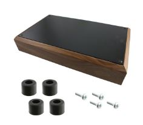

- **50 Double Bananas**: Used for electrical connections and testing purposes. PN BU-P6883.

  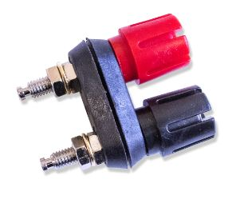

- **2 Gecko Connectors 10P Male**: Connectors for interfacing with specific systems. PN G125-MV11005M2P - 1129036726.

  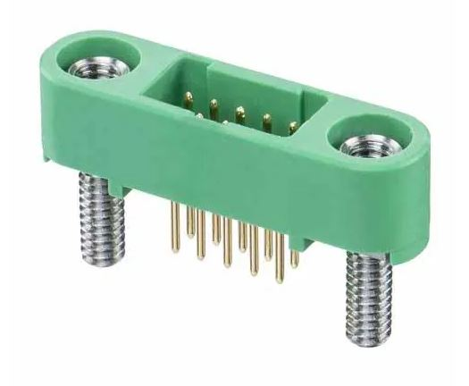

- **6 Gecko Connectors 12P Male**: Additional connectors for broader compatibility. PN G125-MV11205M2P - 1129036727.

  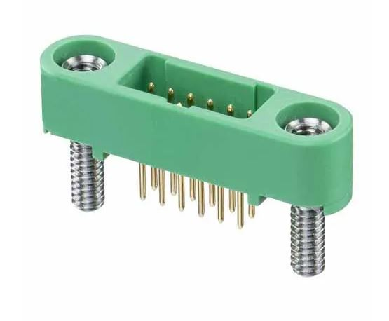

- **2 Gecko Connectors 6P Male**: For specific interface requirements. PN G125-MV10605M2P - 1129036893.

  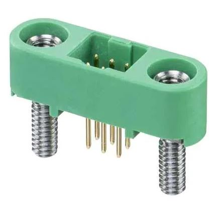

- **28 Countersunk Screws M3x12mm**: Hardware for securely assembling the box. PN DIN 965, RS NUM 528-952.

  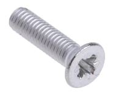

- **28 Spacers of 2.03mm**: Essential for maintaining proper spacing and alignment. PN 905-080.

  

- **2 Header Connectors 10P**: Additional connectors for specific applications. PN 0901301110.

  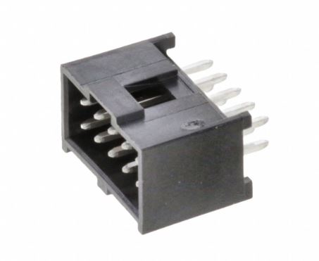

- **6 Header Connectors 12P**: Broader interface options for comprehensive testing. PN 901301112.

  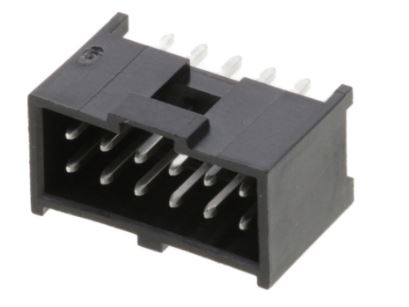

- **2 Header Connectors 6P**: For specialized connections and compatibility. PN 901301106.

  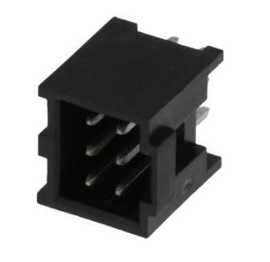

## Assembly:

- **Circuit_Part_10P**: Using a custom circuit design, A 10P Gecko and Header connectors.

  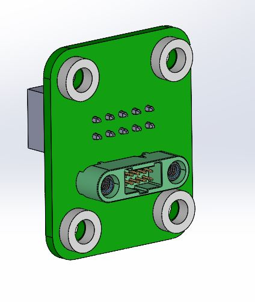

  and inside the box:

  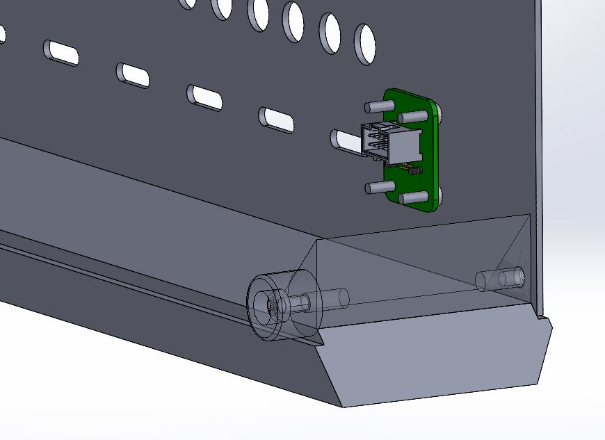

- **The full Box assembly**: For 6/12/23

  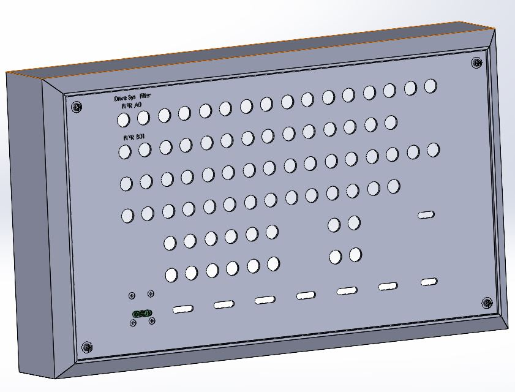

- **New box chosen and the final production**: For 9/7/24
  The project has been completed at this point.
  We have designed a new front panel on another
  box from the shelf: Box_RM2U1918SBK
  
  
  

## Purpose:

The Deployment Box serves as a controlled environment for testing drive systems, providing an organized and secure space to analyze various electrical and mechanical configurations. The combination of aluminum panels and wood shell ensures durability and ease of customization.

## Usage:

- Assemble the box using the provided screws, spacers, and connectors according to the required configuration.
- Utilize the variety of connectors to interface with different drive systems and conduct tests effectively.
- Ensure proper alignment and spacing using the included spacers for accurate testing.

## Contributors:

This project was developed and contributed to by Dr Gal Ben David and Alon Omer Ben David.

## Company:

This project is under the company Dr. Gal Ben-David DSP ltd. Last Updated on 6/12/23

Company: Dr. Gal Ben-David DSP ltd.

